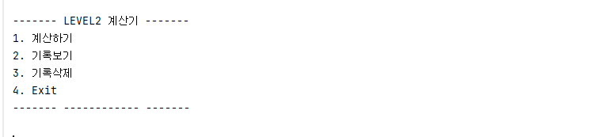
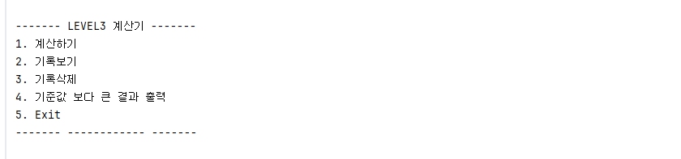

# 계산기 프로젝트

-------------
Java를 활용하여 단계별로 계산기 프로그램을 구현했습니다.

단순한 사칙연산 기능을 구현하는 것에서 시작하여, 단계가 올라갈수록 Java 문법과 개념을 점진적으로 적용 했습니다 (Enum, Generic, Lambda, Stream, switch, 등).

### Project Goal
- 자바 기본 문법을 활용한 프로그램 구현
- 메서드 기능 분리 및 책임 분리
- 컬렉션을 활용한 데이터 관리 (ArrayList)
- 다양한 자바 기능 활용
- 예외 처리 (InputException)

STEP1 - 클래스를 사용하지 않고 Java의 기본 문법을 활용하여 계산기를 구현
- [STEP 1](.src/STEP1/README.md)

STEP2 - 클래스를 활용한 계산기 구현
- [STEP 2](.src/STEP2/README.md)

STEP3 - 도전 기능을 추가적으로 적용하여 계산기를 확장
- [STEP 3](.src/STEP3/README.md)
 

