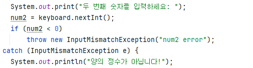
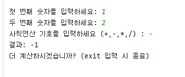

# STEP 1. 계산기 만들기

두 개의 야의 정수와 사칙연산 기호를 입력받아 계산하는 계산기를 구현했습니다.

프로그램 실행 과정은 다음과 같습니다:

### 1. 정수 입력
- `Scanner`를 사용하여 두 개의 정수를 입력
-  음수나 잘못된 형식의 입력이 들어오면 오류 메시지를 출력하고 다시 입력
- `InputMismatchException`을 활용하여 잘못된 숫자 입력을 처리

### 2. 사칙연산 입력
- Scanner를 사용하여 사칙연산 기호를 입력 (+,-,/,*)

### 3. 계산 및 결과 출력
- calculate(int num1, int num2, char op) 함수 호출
- `switch`문을 사용하여 입력받은 연산 기호에 따라 계산을 수행

-------------------------
추가 기능:
- 나눗셈에서 두 번째 숫자가 0인 경우 오류 메시지를 출력
- 'exit' 입력하면 프로그램 종료
- while문을 이용하여 무한으로 계산을 진행