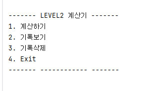
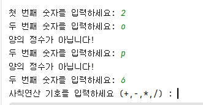

# STEP 2. 클래스를 적용한 계산기 만들기

 ### Classes:
- App.java - 사용자부터 입력을 받아오는 인터페이스
- Calculator.java - 사칙연산을 수행하고 결과를 저장 + 반환 구현

### 구현 내용:
- Calculator 클래스
  - ArrayList로 연산 결과 저장
  - 연산 수행 후 결과값 반환
  - 연산 오류가 발생할 경우 오류 처리: 2/0
  - 결과 기록 getter + setter 메서드
  - 기록 조회 구현
  - 가장 먼저 저장된 데이터 삭제 기능

- App.java
  - 사용자 입력을 담당
  - switch로 (1-4)까지의 메뉴 구성
  - 계산을 반복할 수 있도록 반복문 사용
  - 잘못한 값을 입력 받을 때의 예의 처리

