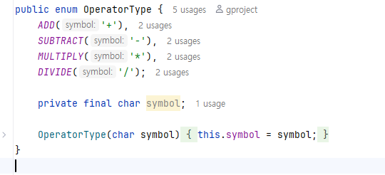
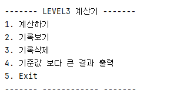

# STEP 3. Enum, 제네릭, 람다 & 스트림 도전 기능

### Classes:
- App.java - 사용자부터 입력을 받아오는 인터페이스
- Arithmetic.java - 사칙연산을 수행 + 다양한 기능 구현
- OperatorType.java - Enum 타입 활용 (+,-,*,/)

### 구현 내용:
- Arithmetic Calculator 클래스 
  - double 값을 입력 받으면 처리하는 제네릭 calculate 클래스
  - switch 케이스를 OperatorType Enum 반영
  - 저장된 연산 결과들 중 입력받은 값보다 큰 결과값 들을 출력하는 기능 
  - Stream + lmabda로 구현
  - 기존 STEP2 기능 유지
- Enum 사칙연산

- App.java
    - switch로 (1-5)까지의 메뉴 구성
    - 계산을 반복할 수 있도록 반복문 사용
    - 잘못한 값을 입력 받을 때의 예의 처리
    - 사용자와 접촉하는 인터페이스

